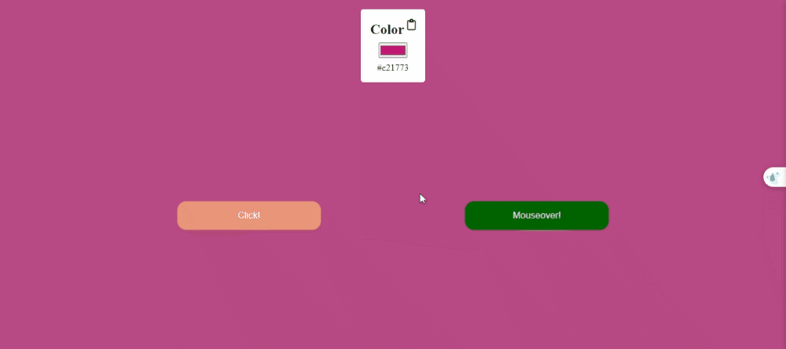

# Random Bg Color 

## Description
The purpose of this project is to randomly set the background color of the page when the button is clicked or hovered using JS DOM. Determining the adjusted color as the color of the input and printing the color on the screen. As a bonus, you can copy the color with clipboard and adjust the desired color from the color palette.

## Technologies:
- HTML
- CSS
- JavaScript

## Demo

[Random Bg Color ](https://meryemsenturk.github.io/Random-Bg-Color/)